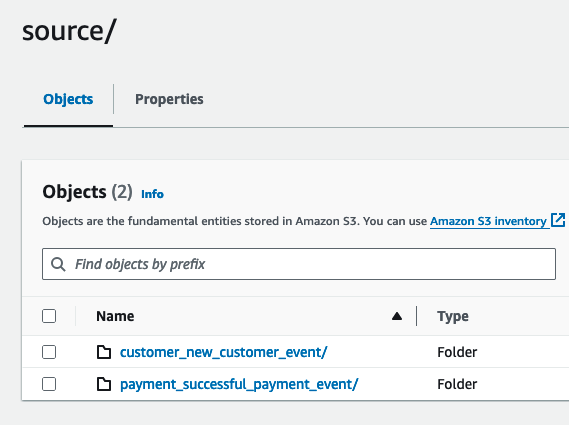
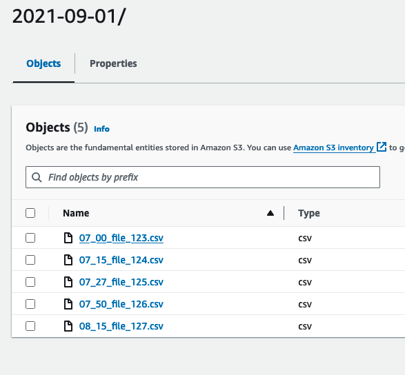
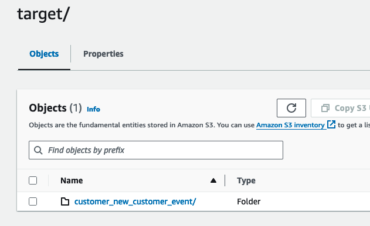
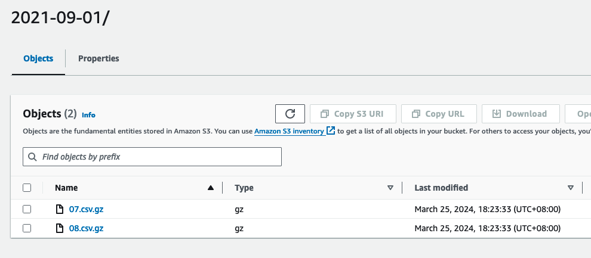
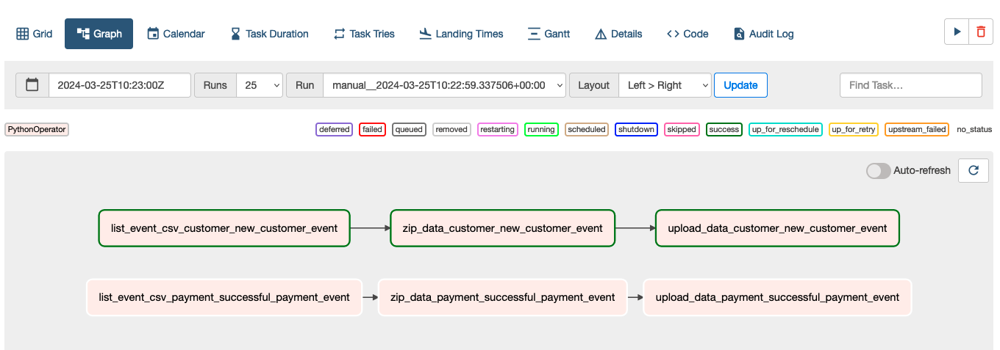

Please refer to my answer for Exercise 5

## Environment Assumption
1. Airflow 2.5 Running on Mac Silicon
2. AWS S3 is used as file storage, with versioning enabled
3. Customized dag class is used in this testing yet the general structure does not change

## S3 Bucket setting

Source Bucket:




Target Bucket:




## Airflow Dag

### Dag Design

Refer to [dag_ex4.py](dag_ex4.py)

### Workflow Explain
1. The dag runs every 30 minute (schedule='0/30 * * * *',)
2. All S3 api call are done by calling S3Hook
3. The workflow works like below:
   1. Call `get_event_list()` to retrieve all events under `source/{event}/{date}` prefix
   2. Loop over the event list and go over 3 steps:
      1. Get list of new csv files
         - To filter files where modify time >= `from_datetime` 
         - `from_datetime` is expected to be `{{ data_interval_start }}` which is the end time of the last batch
         - The list contains BOTH on-time and delayed data file
         - XCom push the file list for the next step
      2. gzip the data
         -  Pull the result from the previous step
         -  Derive the target file name and check its existance
         -  Create or Download (if exist) gzip file
         -  Write new files to the gzip
         -  return list of zip files to be uploaded to S3
      3. upload the gzip to S3 target `target/{event}/{date}`
         - Pull the zip file list from the previous step
         - Load (or replace) the gzip file

This design is scalable and sustainable so that:
1. It caters new events automatically without code change
2. It ONLY downloads files to be changed and append new files to be added
3. It doesnt matter if data is delayed for unknown period of time as it is process data by object modification time
4. No extra packages needed

### Airflow Task Log
1. Get NEW file list from S3 
```
[2024-03-25, 10:23:09 UTC] {base.py:73} INFO - Using connection ID 'aws_default' for task execution.
[2024-03-25, 10:23:09 UTC] {credentials.py:1253} INFO - Found credentials in shared credentials file: ~/.aws/credentials
[2024-03-25, 10:23:10 UTC] {python.py:177} INFO - Done. Returned value was: ['source/customer_new_customer_event/2021-09-01/07_00_file_123.csv', 'source/customer_new_customer_event/2021-09-01/07_15_file_124.csv', 'source/customer_new_customer_event/2021-09-01/07_27_file_125.csv', 'source/customer_new_customer_event/2021-09-01/07_50_file_126.csv', 'source/customer_new_customer_event/2021-09-01/08_15_file_127.csv']
[2024-03-25, 10:23:10 UTC] {taskinstance.py:1327} INFO - Marking task as SUCCESS. dag_id=data_test_dag, task_id=list_event_csv_customer_new_customer_event, execution_date=20240325T102259, start_date=20240325T102308, end_date=20240325T102310
[2024-03-25, 10:23:10 UTC] {local_task_job.py:159} INFO - Task exited with return code 0
[2024-03-25, 10:23:11 UTC] {taskinstance.py:2582} INFO - 1 downstream tasks scheduled from follow-on schedule check
```

2. Gzip Data
```
[2024-03-25, 10:23:14 UTC] {logging_mixin.py:137} INFO - >>>  target/customer_new_customer_event/2021-09-01/08.csv.gz
[2024-03-25, 10:23:14 UTC] {base.py:73} INFO - Using connection ID 'aws_default' for task execution.
[2024-03-25, 10:23:14 UTC] {credentials.py:1253} INFO - Found credentials in shared credentials file: ~/.aws/credentials
[2024-03-25, 10:23:15 UTC] {logging_mixin.py:137} INFO - >>>  target/customer_new_customer_event/2021-09-01/07.csv.gz
[2024-03-25, 10:23:15 UTC] {logging_mixin.py:137} INFO - >>>>>  {'08': {'exist': False, 'subsets': ['source/customer_new_customer_event/2021-09-01/08_15_file_127.csv']}, '07': {'exist': False, 'subsets': ['source/customer_new_customer_event/2021-09-01/07_15_file_124.csv', 'source/customer_new_customer_event/2021-09-01/07_27_file_125.csv', 'source/customer_new_customer_event/2021-09-01/07_50_file_126.csv']}}
[2024-03-25, 10:23:23 UTC] {credentials.py:1253} INFO - Found credentials in shared credentials file: ~/.aws/credentials
[2024-03-25, 10:23:24 UTC] {credentials.py:1253} INFO - Found credentials in shared credentials file: ~/.aws/credentials
[2024-03-25, 10:23:24 UTC] {credentials.py:1253} INFO - Found credentials in shared credentials file: ~/.aws/credentials
[2024-03-25, 10:23:25 UTC] {credentials.py:1253} INFO - Found credentials in shared credentials file: ~/.aws/credentials
[2024-03-25, 10:23:27 UTC] {python.py:177} INFO - Done. Returned value was: ['08.csv.gz', '07.csv.gz']
```

3. Upload gzip to S3
```
[2024-03-25, 10:23:31 UTC] {base.py:73} INFO - Using connection ID 'aws_default' for task execution.
[2024-03-25, 10:23:31 UTC] {credentials.py:1253} INFO - Found credentials in shared credentials file: ~/.aws/credentials
[2024-03-25, 10:23:32 UTC] {logging_mixin.py:137} INFO - Zip file '08.csv.gz' created and uploaded to S3.
[2024-03-25, 10:23:32 UTC] {logging_mixin.py:137} INFO - Zip file '07.csv.gz' created and uploaded to S3.
[2024-03-25, 10:23:32 UTC] {python.py:177} INFO - Done. Returned value was: None
```
